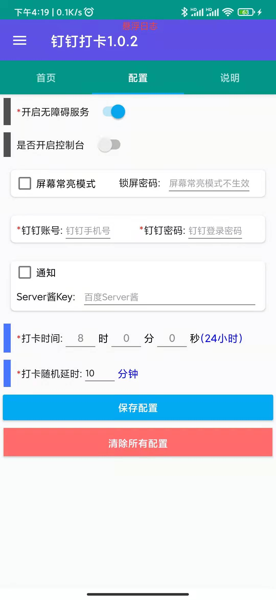
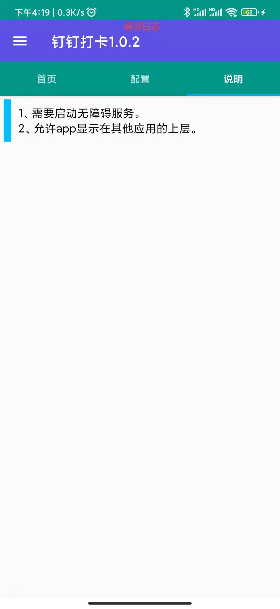
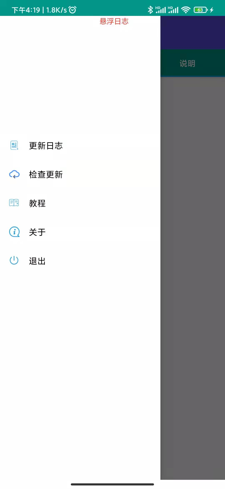

# autojs-script
autojs脚本集合

# Auto.js

[官网链接](https://pro.autojs.org/)

[文档链接](https://pro.autojs.org/docs/#/zh-cn/?id=综述)

# 1. UI模板

页面主要功能来源于MonkT，[CSDN博客](https://blog.csdn.net/zy0412326/article/details/104767602)，原作者[博客](https://www.yadinghao.com/)

我主要结合部分场景对UI进行了丰富，删除了原有控制台代码，添加了浮动日志显示。

## 页面截图

### 首页

### 配置

{:width="300px"}

### 说明

### 菜单

# 2. 钉钉打卡脚本

dddk
